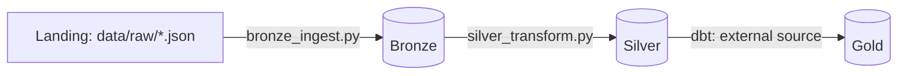

# Arquitetura Medallion — Qualidade do Ar

Evolui o pipeline do [Projeto 01](https://github.com/amanda-martins-data/pipeline-qualidade-ar)
para uma arquitetura de data lake em três camadas (**Bronze → Silver →
Gold**), com dbt operando diretamente sobre arquivos Parquet e uma
classificação de **Índice de Qualidade do Ar (AQI)** aplicada na
camada Gold.

Projeto 03 de uma série de 6 documentando minha transição de Analista
de Dados para Engenharia/Arquitetura de Dados — veja o [perfil
completo](https://github.com/amanda-martins-data).

## Arquitetura



Decisões de arquitetura e trade-offs documentados em
[`docs/architecture.md`](docs/architecture.md).

## Stack

`Python` · `DuckDB` · `dbt` · `Parquet` · `pandas` · `pyarrow`

## Estrutura

```
.
├── src/
│   ├── extract.py / generate_sample_data.py  # extração (do Projeto 01)
│   ├── bronze_ingest.py                      # landing -> Bronze (Parquet, imutável)
│   └── silver_transform.py                   # Bronze -> Silver (limpo, deduplicado)
├── dbt_project/models/gold/
│   ├── sources.yml                # aponta pra Silver via read_parquet
│   ├── air_quality_daily_gold.sql # agregação + classificação AQI
│   └── schema.yml                 # testes de dados
├── bronze/    # Parquet particionado por ingestion_date (gerado em runtime)
├── silver/    # Parquet particionado por measured_date (gerado em runtime)
├── gold/      # Parquet final, consumível por BI (gerado em runtime)
└── docs/architecture.md
```

## Como rodar

```bash
pip install -r requirements.txt

# 1. extração (dados sintéticos, sem API key)
python src/generate_sample_data.py

# 2. Bronze: landing -> Parquet imutável particionado por ingestão
python src/bronze_ingest.py

# 3. Silver: limpeza, tipagem, deduplicação, particionado por medição
python src/silver_transform.py

# 4. Gold: agregação + classificação AQI, via dbt (lê/escreve Parquet direto)
cd dbt_project
cp profiles.yml.example profiles.yml
dbt build --profiles-dir .
```

## Resultado

`gold/air_quality_daily/data.parquet` — uma linha por cidade + poluente
+ dia, com classificação de AQI para PM2.5:

| city           | parameter | avg_value | aqi_category_pm25             |
|----------------|-----------|-----------|--------------------------------|
| Belo Horizonte | pm25      | 35.49     | Insalubre p/ grupos sensíveis  |
| Rio de Janeiro | pm25      | 26.02     | Moderada                       |
| São Paulo      | pm25      | 37.46     | Insalubre p/ grupos sensíveis  |

## Próximos passos do portfólio

- **Projeto 02 (retroalimentação)** — encaixar as 3 camadas como tasks
  do Airflow no lugar do `load_to_duckdb` único.
- **Projeto 06** — observabilidade e testes de qualidade mais robustos
  sobre as camadas Bronze/Silver.
