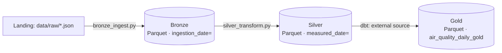

# Arquitetura — Medallion (Bronze / Silver / Gold)

## Visão geral

Evolução direta do [Projeto 01](https://github.com/amanda-martins-data/pipeline-qualidade-ar):
mesma fonte de dados (OpenAQ), agora organizada em um data lake físico
de três camadas, com dbt operando diretamente sobre arquivos Parquet
— sem tabelas carregadas "escondidas" num warehouse.

## Decisões e trade-offs

### 1. Parquet como formato universal do lake
Colunar, comprimido, com schema embutido e lido nativamente por
DuckDB, Spark, pandas, Polars ou qualquer engine analítica moderna.
A escolha do formato de arquivo é o que torna o lake portável — trocar
de motor de consulta não exige reprocessar os dados.

### 2. Partição por `ingestion_date` na Bronze, `measured_date` na Silver
São particionamentos deliberadamente diferentes:
- **Bronze** particiona por **quando o dado chegou**. É a camada de
  auditoria — "o que sabíamos e quando soubemos". Nunca é reescrita.
- **Silver** particiona por **quando o evento aconteceu**. É a camada
  que o negócio de fato consulta por período, e reprocessar um dia
  específico (ex.: uma correção de regra) significa regravar apenas
  aquela partição, não a tabela inteira.

### 3. Bronze é imutável; Silver é idempotente por partição
Bronze só recebe `INSERT` (novos arquivos particionados por execução);
nunca é limpa ou reescrita — é a fonte de verdade para reprocessamento
completo caso uma regra de limpeza mude.
Silver, ao contrário, **reescreve por completo** a partição de
`measured_date` afetada a cada execução (`silver_transform.py` apaga e
regrava o diretório da partição). Rodar duas vezes no mesmo dia nunca
duplica dado — a idempotência vem da estratégia de escrita, não de um
`DELETE WHERE` manual.

### 4. dbt lendo e escrevendo Parquet diretamente (sem tabela intermediária)
A fonte `silver.air_quality` no dbt não é uma tabela carregada — é uma
`view` do dbt-duckdb sobre `read_parquet(...)` (via `meta.external_location`).
O modelo `air_quality_daily_gold` é materializado como `external`,
gravando o resultado direto em `gold/air_quality_daily/data.parquet`.
Isso significa que o "warehouse" (`medallion.duckdb`) é só o motor de
consulta — o dado de verdade sempre mora nos arquivos do lake, não
preso dentro de um arquivo de banco proprietário.

### 5. Classificação de AQI centralizada em SQL declarativo
A faixa de Índice de Qualidade do Ar (baseada em PM2.5, escala
simplificada da EPA) vive como um `CASE WHEN` único no modelo Gold —
não espalhada em código de aplicação ou em múltiplos dashboards. Se a
faixa mudar (ex.: adotar a escala de outro órgão), há um único lugar
para atualizar, testado por `accepted_values`.

## Validação

Pipeline testado de ponta a ponta: `generate_sample_data.py` →
`bronze_ingest.py` → `silver_transform.py` → `dbt build`, com o modelo
Gold e os 4 testes de dados passando, e a coluna `aqi_category_pm25`
verificada manualmente contra as faixas esperadas.

## Limitações conhecidas / próximos passos
- Sem orquestração própria ainda — o próximo passo natural é encaixar
  este pipeline de 3 camadas como tasks do **Projeto 02** (Airflow),
  substituindo o `load_to_duckdb` único por três tasks em sequência.
- Sem estratégia de schema evolution formalizada (ex.: o que acontece
  se a OpenAQ adicionar um novo poluente) — hoje um valor novo em
  `parameter` simplesmente não recebe categoria de AQI.
- Sem compactação de pequenos arquivos na Bronze — em produção, uma
  rotina periódica de `OPTIMIZE`/compaction seria necessária conforme
  o histórico cresce.
